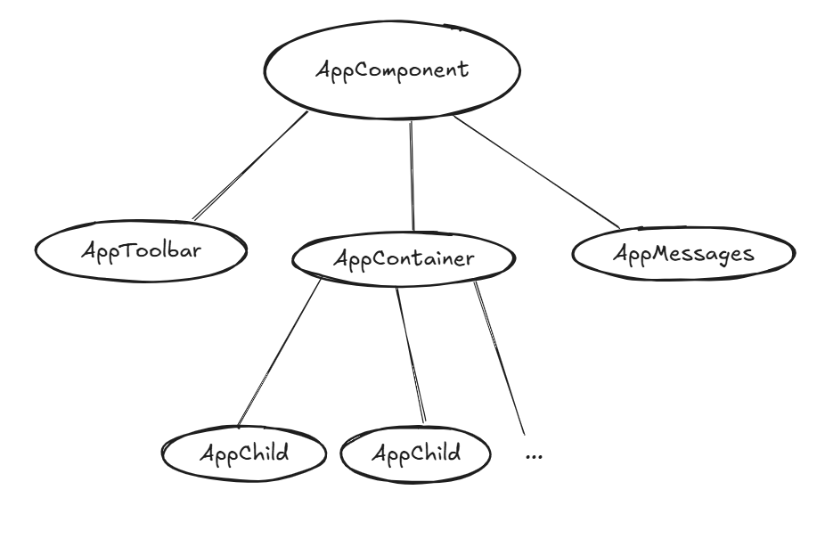

# Change Detection Strategy default VS OnPush

## Introduction:
Simple demonstration of how Change Detection Default and OnPush differently explore subtrees of components.

The app is composed by:
- A toolbar where an input textbox has a listener to a mouse down event, which will trigger the change detection as soon as the user starts typing into it.
- A message box on the right where the components checked by the CD logs a message
- A container on the left where children items can be added from the toolbar. An item will quickly blink red when is checked by the Change Detection cycle

This is the Angular component diagram:

The Change Detection Default is applied by default to all elements in an Angular component, but you can specify a different strategy called `OnPush`.
You can see how differently the change detection inspects elements by changing the strategy of the AppContainer component.

#### The differences
When user types into the textbox, a CD cycle is triggered and the possible scenario will happen
1. With `Default`
All AppChild compnents under App-container will be checked at each cycle
2. With `OnPush`
No AppChild components under AppContainer will be checked

The AppContainer and its children will be checked only when AppContainer inputs are changed or when web events are triggered inside this component.
Try hovering the mouse on the `Trigger a timeout from this component` button, and switch between the Default and OnPush strategy to see that the CD will inspect Container and all children.
On the other hand, notice how different the `setTimeout` behaves when it's launched. Try clicking the button and switch between the strategies to see how different is the inspection